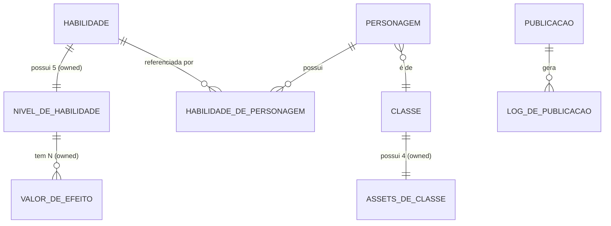

# Data Model — Auditoria das Habilidades Mineradas

**Feature**: 005-auditoria-habilidades-mineradas
**Date**: 2026-09-08
**Prerequisites**: [research.md](./research.md)

Modelo de domínio focado nas mudanças da Feature 005 sobre a base já entregue pela Feature 003. Entidades pré-existentes são citadas apenas onde precisam de alteração.

---

## 1. Habilidade (raiz existente) — Adição da coleção Niveis

**Localização**: `src/DarkestDungeon.Domain/Habilidades/Habilidade.cs` (raiz TPH), com filhas `HabilidadeDeCombate` e `HabilidadeDeAcampamento`.

### Novos campos

| Campo | Tipo | Descrição | Origem |
|---|---|---|---|
| `Niveis` | `IReadOnlyList<NivelDeHabilidade>` (owned) | Exatamente 5 linhas (Level 1..5) | FR-003a |

### Invariantes

- `Niveis.Count == 5` — validado no construtor e nas transições de estado.
- `Niveis` está ordenada por `NumeroDoNivel` ascendente (1..5) sem gaps.
- Level 1 preserva os valores originais da Feature 003 para todas as 219 habilidades (baseline SC-002).

### Transições

| De | Para | Trigger | Regras |
|---|---|---|---|
| Estado inicial (5 níveis com placeholders) | 5 níveis preenchidos | Ação `PreencherNiveisDaWiki(JsonSnapshot)` | Todos 5 valores da wiki devem estar presentes; caso contrário levels ausentes ficam com placeholder `null` e a habilidade entra em `Pendente` no Mapa de Cobertura |

---

## 2. NivelDeHabilidade (novo owned type)

**Localização**: `src/DarkestDungeon.Domain/Habilidades/NivelDeHabilidade.cs`

### Campos

| Campo | Tipo | Constraint | Descrição |
|---|---|---|---|
| `NumeroDoNivel` | `int` | `[1..5]` (CHECK) | Nível 1 a 5 conforme wiki |
| `ModificadorDano` | `int` | `[-100..500]` | Modificador de dano em % naquele nível |
| `ModificadorAcerto` | `int` | `[-100..500]` | Modificador de acerto |
| `ModificadorCritico` | `int` | `[-50..100]` | Modificador crítico |
| `LimitePorUso` | `int?` | `≥ 0` | Ex.: "Uso 3× por batalha"; `null` = ilimitado |
| `CustoDeDescanso` | `int?` | `≥ 0` | Só para acampamento |
| `Efeitos` | `IReadOnlyList<ValorDeEfeito>` (owned) | contagem por nível (varia por habilidade) | Valores numéricos oficiais por efeito naquele nível |

### Chave

- Composta: `(HabilidadeId, NumeroDoNivel)` — mapeada por `OwnsMany` no EF.

### Regras de negócio

- Level 1 de qualquer habilidade nova MUST ser idêntico aos valores originais da Feature 003 (compatibilidade).
- Instância congelada após construção (record class); alterações via novo `Habilidade` publicado.

---

## 3. ValorDeEfeito (novo sub-owned)

**Localização**: `src/DarkestDungeon.Domain/Habilidades/ValorDeEfeito.cs`

### Campos

| Campo | Tipo | Descrição |
|---|---|---|
| `TipoDoEfeito` | `string` | Chave semântica (ex.: "Sangramento", "Redução de Tocha", "Cura") |
| `Valor` | `int` | Valor numérico por nível (pode ser negativo para redução) |
| `Chance` | `int?` | Chance base %; null se determinístico |

### Regras

- Tipos padronizados: catálogo `TiposDeEfeito` estático no Domain, usado por auditoria para detectar strings simplificadas (FR-010).

---

## 4. HabilidadeDePersonagem (revisada)

**Localização**: `src/DarkestDungeon.Domain/Seres/HabilidadeDePersonagem.cs`

### Campos (nova versão)

| Campo | Tipo | Constraint | Descrição |
|---|---|---|---|
| `HabilidadeId` | `Guid` | FK → `Habilidades.Id` | Habilidade referenciada |
| `NumeroDoNivel` | `int` | `[0..5]` (CHECK) | 0 = bloqueada, 1..5 = treinada nesse nível |
| `Equipada` | `bool` | — | Só faz sentido para habilidade de acampamento |

### Campos removidos

| Campo antigo | Motivo |
|---|---|
| `Treinada` (bool persistido) | Derivado: `NumeroDoNivel >= 1` (FR-007g) |
| `Habilitada` (bool persistido) | Sinônimo de `Treinada` — eliminado |

### Propriedades computed (não persistidas)

```csharp
public bool Treinada => NumeroDoNivel >= 1;
public bool Habilitada => Treinada;
```

### Invariantes (validadas no agregado `Personagem`)

- `Equipada == true` requer `Habilidade.Tipo == Acampamento` e `Treinada == true`.
- Por Personagem: `HabilidadesDePersonagem.Count(x => x.Equipada && x.Habilidade.Tipo == Acampamento) <= 3` (FR-007c).
- `HabilidadeId` MUST pertencer à associação Classe × Habilidade da Classe do Personagem (FR-007e).

---

## 5. Personagem — Novos campos

**Localização**: `src/DarkestDungeon.Domain/Seres/Personagem.cs`

### Novos campos

| Campo | Tipo | Default | Constraint |
|---|---|---|---|
| `Aparencia` | `AparenciaDePersonagem` (enum) | `A` | Faixa fechada A/B/C/D |
| `Experiencia` | `int` | `0` | `≥ 0` (CHECK) |

> **Nota (3ª clarify)**: `ModoDeCampanha` foi **removido** — o sistema opera apenas no modo mais difícil. Não há campo de modo em `Personagem`.

### Campos preexistentes ajustados

| Campo | Ajuste |
|---|---|
| `Nivel` | Permanece `int` mas passa a ser **derivado** de `Experiencia` via `TabelaDeExperiencia.Resolver(Experiencia)`. Setter privado; alterado apenas por `GanharExperiencia(int)` |
| `LimiteHabilidadesDeCombate` (const 6) | **REMOVIDO** — combate não tem limite (FR-007b) |
| `LimiteHabilidadesDeAcampamento` (const 6) | **REMOVIDO** — substituído por `LimiteEquipadasAcampamento = 3` (FR-007c) |

### Novos métodos

- `Personagem.GanharExperiencia(int xp)` — soma XP, recomputa `Nivel`, se subiu aplica `+10%` nas resistências (Atordoamento, Sangramento, Envenenamento, Movimento, Debuff) e `+10%` em `ChanceDesarmarArmadilha`.
- `Personagem.TreinarHabilidade(Guid habilidadeId, int nivel)` — 1..5, valida associação Classe × Habilidade.
- `Personagem.EquiparAcampamento(Guid habilidadeId)` — valida limite 3, tipo Acampamento, treinada.
- `Personagem.DesequiparAcampamento(Guid habilidadeId)` — simétrico.

### Invariantes

- `Aparencia` MUST estar dentro do enum (400 em PT-BR se rejeitado — SC-013).
- `Experiencia ≥ 0`.
- Bônus de resistência acumulado = `Nivel × 10` pontos percentuais sobre a base da Classe (SC-015).

---

## 6. AparenciaDePersonagem (novo enum)

**Localização**: `src/DarkestDungeon.Domain/Personagens/AparenciaDePersonagem.cs`

```csharp
public enum AparenciaDePersonagem
{
    A = 0,  // default
    B = 1,
    C = 2,
    D = 3,
}
```

Armazenado como `INT` no SQL Server para performance de filtro.

---

## 7. ~~ModoDeCampanha~~ (REMOVIDO na 3ª clarify)

> **Decisão**: `ModoDeCampanha` foi **removido do modelo**. O sistema oferece apenas o modo mais difícil (equivalente a Darkest/Stygian oficialmente idênticos). Radiant não é suportado. Não há enum nem campo em `Personagem` para modo de campanha. Toda a lógica de XP usa a tabela única descrita na seção 9.

---

## 8. NivelDeResolucao (value object)

**Localização**: `src/DarkestDungeon.Domain/Personagens/NivelDeResolucao.cs`

### Campos

| Campo | Tipo | Descrição |
|---|---|---|
| `Valor` | `int` | 0..6 |
| `Nome` | `string` | PT-BR canônico: `Curioso` (0), `Aprendiz` (1), `Aventureiro` (2), `Veterano` (3), `Mestre` (4), `Campão` (5), `Lenda` (6). Usado em API e mensagens. |
| `NomeOriginal` | `string` | Inglês para rastreabilidade com a wiki: `Seeker` (0), `Apprentice` (1), `Adventurer` (2), `Veteran` (3), `Master` (4), `Champion` (5), `Legend` (6). |
| `BonusResistenciaPercentual` | `int` | `Valor * 10` |

### Regras

- Immutable record.
- `NivelDeResolucao.De(int valor)` — factory que retorna instância nomeada; lança se fora de 0..6.
- Padrão `Nome`/`NomeOriginal` análogo ao `NomeExibicao`/`NomeOriginal` de `Habilidade` na Feature 003 (constitucional IV + rastreabilidade wiki).

---

## 9. TabelaDeExperiencia (dado imutável do Domain — modo único)

**Localização**: `src/DarkestDungeon.Domain/Personagens/TabelaDeExperiencia.cs`

### Constante

```csharp
public static readonly IReadOnlyList<int> Limiares = new[] { 2, 8, 14, 24, 36, 48 };
// atinge Nivel 1, 2, 3, 4, 5, 6 respectivamente
```

### API

- `NivelDeResolucao Resolver(int experiencia)` — retorna o maior `Nivel` cujo limiar ≤ `experiencia`.
- `int XpFaltandoParaProximoNivel(int experiencia)` — 0 se já Nivel 6.

> **Nota (3ª clarify)**: `Resolver` **não recebe** parâmetro de modo de campanha. A tabela é única — valores oficiais do modo mais difícil (equivalente a Darkest/Stygian).

---

## 10. AssetsDeClasse (nova owned collection em ClasseDeHeroi — vincula inventário 004)

**Localização**: `src/DarkestDungeon.Domain/Classes/AssetsDeClasse.cs`

### Campos

| Campo | Tipo | Constraint | Descrição |
|---|---|---|---|
| `Aparencia` | `AparenciaDePersonagem` | Único por Classe | A/B/C/D |
| `ConjuntoSpineId` | `string` | Nulo permitido; até 64 chars | Identificador do `Conjunto Spine` no inventário da Feature 004 |
| `HashArquivo` | `string` | Nulo permitido; SHA-256 (64 chars) | Hash do arquivo principal para detecção de substituição silenciosa |
| `Status` | `StatusDeCobertura` | `Coletado` ou `Pendente` | Auditado por FR-007j |

> **Nota (3ª clarify)**: **Não guarda paths nem bytes**. A resolução do caminho renderizável final (trio Spine: textura + atlas + esqueleto) ocorre por lookup no inventário da Feature 004 usando `ConjuntoSpineId`. `HashArquivo` valida integridade cross-feature.

### Cardinalidade

- Cada `ClasseDeHeroi` tem exatamente 4 registros (A/B/C/D) — total 80 combinações auditadas.
- Se o inventário 004 não estiver disponível no ambiente, todos os 80 registros ficam com `ConjuntoSpineId = null` e `Status = Pendente`.

---

## 11. LogDePublicacao (nova entidade)

**Localização**: `src/DarkestDungeon.Application/Publicacao/LogDePublicacao.cs`

### Campos

| Campo | Tipo | Constraint |
|---|---|---|
| `Id` | `Guid` | PK |
| `PublicacaoId` | `Guid` | Agrupa a corrida; índice |
| `Timestamp` | `DateTime` (UTC) | `DATETIME2` |
| `Nivel` | `NivelDeLog` (enum) | `Info`/`Warn`/`Error` |
| `HabilidadeId` | `Guid?` | Nullable |
| `NomeExibicao` | `string?` | Nullable, max 200 |
| `Campo` | `string?` | Nullable, max 64 |
| `Mensagem` | `string` | Max 1000 |
| `StackTrace` | `string?` | `NVARCHAR(MAX)` |

### Índice

- `IX_LogsDePublicacao_PublicacaoId_Timestamp` (composto).

---

## 12. RelatorioDeAuditoria (DTO agregado — não persistido)

**Localização**: `src/DarkestDungeon.Application/Auditoria/RelatorioDeAuditoria.cs`

### Estrutura

```csharp
public sealed record RelatorioDeAuditoria(
    DateTime GeradoEm,
    IReadOnlyList<LinhaDeAuditoria> Linhas,
    ResumoDeAuditoria Resumo
);

public sealed record LinhaDeAuditoria(
    Guid HabilidadeId,
    string NomeExibicao,
    string ClasseDoDono,
    StatusDeAuditoria Status,
    IReadOnlyList<DiffDeCampo> Diffs
);

public sealed record DiffDeCampo(
    string Campo,           // ex.: "efeitos", "modificadorDano", "niveis[3].valor"
    string ValorEsperado,   // wiki
    string ValorAtual,      // seed
    string Observacao       // livre — para FR-010/FR-011
);

public sealed record ResumoDeAuditoria(
    int TotalHabilidades,   // 219
    int Ok,
    int Parcial,
    int Faltando,
    int NiveisPendentes     // FR-003b
);
```

### Formato de saída

- Serializado como Markdown em `specs/005-auditoria-habilidades-mineradas/relatorio.md` pelo `AuditoriaWikiService` (opcional: também expõe JSON via endpoint).

---

## 13. StatusDeAuditoria (enum)

```csharp
public enum StatusDeAuditoria
{
    OK = 0,
    Parcial = 1,
    Faltando = 2,
}
```

---

## Diagrama de Relacionamentos (Mermaid)



---

## Compatibilidade com Feature 003

- Todas as 219 habilidades já semeadas continuam com `Id` preservado (SC-003).
- Personagens existentes na Feature 003 recebem defaults: `Aparencia=A`, `Experiencia=0`, todas as habilidades já atribuídas em `NumeroDoNivel=1`. **Não há campo `ModoDeCampanha`** — o sistema opera em modo único global (equivalente a Darkest/Stygian oficial).
- Contagens preservadas: 20 classes, 219 habilidades, 277 associações (SC-005).

---

## Novos Volumes

| Entidade | Contagem Esperada |
|---|---|
| `NivelDeHabilidade` | 219 × 5 = **1.095 linhas** |
| `ValorDeEfeito` | ~2.500 (média 2 efeitos por nível de habilidade, variável) |
| `AssetsDeClasse` | 20 × 4 = **80 linhas** |
| `LogsDePublicacao` | crescimento ~1 linha por evento; ~5-20 linhas por publicação bem-sucedida |
