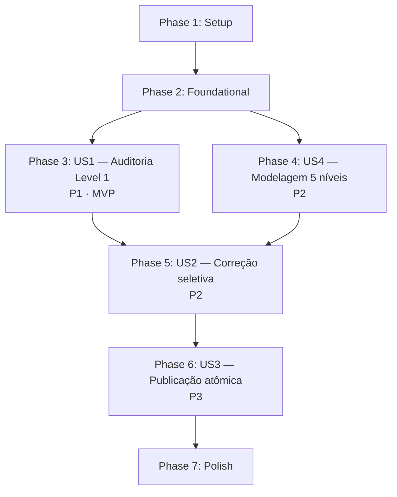

# Tasks: Auditoria das Habilidades Mineradas da Wiki

**Input**: Design documents from `/specs/005-auditoria-habilidades-mineradas/`

**Prerequisites**: plan.md, spec.md, research.md, data-model.md, contracts/, quickstart.md

**Tests**: Testes obrigatórios por princípio constitucional III (contratos verificáveis) — incluídos em cada fase de user story.

**Organization**: Tarefas agrupadas por user story. US1 (P1) é o MVP.

**Revisão pós 3ª clarify (2026-09-08)**:
- Removido `ModoDeCampanha` (modo único de campanha).
- `AssetsDeClasse` vincula inventário da Feature 004 (ConjuntoSpineId + hash), sem paths livres.
- `NivelDeResolucao` traduzido: `Curioso`/`Aprendiz`/…/`Lenda` + `NomeOriginal` inglês.
- Baseline (4 classes) reminada da wiki (Level 1..5), com meta ≥ 90% OK.
- Armas/armaduras/itens explicitamente fora do escopo (Feature 006 futura).

## Format: `[ID] [P?] [Story?] Descrição`

- **[P]**: Pode rodar em paralelo (arquivos diferentes, sem dependências)
- **[Story]**: US1, US2, US3, US4
- Cada descrição contém o caminho exato do arquivo

## Path Conventions (Web-Service em camadas C#)

- Domain: `src/DarkestDungeon.Domain/`
- Application: `src/DarkestDungeon.Application/`
- Infrastructure: `src/DarkestDungeon.Infrastructure/`
- Api: `src/DarkestDungeon.Api/`
- Tests: `tests/DarkestDungeon.Tests/`
- Specs: `specs/005-auditoria-habilidades-mineradas/`

---

## Phase 1: Setup (Infraestrutura Compartilhada)

**Objetivo**: Preparar ambiente e artefatos base da Feature 005 sem alterar código de produção ainda.

- [X] T001 Verificar baseline: rodar `dotnet test --nologo` e confirmar 141 testes verdes; anotar em `specs/005-auditoria-habilidades-mineradas/notas-implementacao.md`
- [X] T002 Verificar Docker `mssql-dd` rodando e migration `20260908131601_SchemaCompleto` aplicada via `dotnet ef migrations list --project src/DarkestDungeon.Infrastructure --startup-project src/DarkestDungeon.Api`
- [X] T003 [P] Criar pasta `specs/005-auditoria-habilidades-mineradas/wiki-snapshots/` para receber os JSONs de mineração das 20 classes (baselines inclusas — Q3)
- [X] T004 [P] Criar `specs/005-auditoria-habilidades-mineradas/notas-implementacao.md` com estado inicial (contagens 20/219/277) e checklist de progresso
- [X] T005 Ajustar connection string em `src/DarkestDungeon.Api/appsettings.json` adicionando `Application Name=DarkestDungeon.Api` na CS principal (necessário para detecção de sessões — research R3)
- [X] T006 [P] Verificar disponibilidade do inventário da Feature 004 (arquivo/tabela conforme convenção 004); se não existir, anotar em `notas-implementacao.md` que todas as 80 combinações Classe × Aparência serão marcadas `Pendente` (previsto em FR-007j)

**Checkpoint**: Ambiente pronto, baseline verde, dependência 004 mapeada, sem alteração de produção.

---

## Phase 2: Foundational (Bloqueadores para todas as user stories)

**Objetivo**: Criar tipos-base compartilhados por US1/US2/US3/US4. Nenhuma US pode começar sem esta fase.

**CRITICAL**: Todas as tarefas desta fase MUST estar concluídas antes de iniciar qualquer US.

- [X] T007 [P] Criar enum `AparenciaDePersonagem` em `src/DarkestDungeon.Domain/Personagens/AparenciaDePersonagem.cs` (A=0, B=1, C=2, D=3)
- [X] T008 [P] Criar enum `StatusDeAuditoria` em `src/DarkestDungeon.Application/Auditoria/StatusDeAuditoria.cs` (OK, Parcial, Faltando)
- [X] T009 [P] Criar enum `StatusDeCobertura` em `src/DarkestDungeon.Domain/Comum/StatusDeCobertura.cs` (Coletado, Pendente)
- [X] T010 [P] Criar enum `NivelDeLog` em `src/DarkestDungeon.Application/Publicacao/NivelDeLog.cs` (Info, Warn, Error)
- [X] T011 [P] Criar catálogo de tipos de efeito `TiposDeEfeito` (const strings) em `src/DarkestDungeon.Domain/Habilidades/TiposDeEfeito.cs` (Sangramento, Envenenamento, Redução de Tocha, Cura, Atordoamento, etc.)
- [X] T012 Atualizar `notas-implementacao.md` seção "Convenções PT-BR das mensagens" listando as strings padronizadas usadas nas rejeições 400 (fonte de verdade única)

**Checkpoint**: Enums e constantes compartilhadas disponíveis; nenhuma alteração de tabela ainda.

---

## Phase 3: User Story 1 — Auditoria Comparativa Level 1 (Priority P1) 🎯 MVP

**Objetivo (spec US1)**: Curador consegue gerar relatório por classe indicando `OK`/`Parcial`/`Faltando` das 219 habilidades comparando os 15 campos Level 1 contra a wiki oficial.

**Independent Test**: Rodar job runner na classe Cruzado — habilidades saem como `OK` (baseline) ou `Parcial` com diff caso mineração fresca detecte divergência (Q3 → meta ≥ 90% OK); rodar em classe minerada tardiamente — habilidades com dados simplificados saem como `Parcial` com diff textual.

### Mineração assistida das 20 classes — Level 1..5 completo (Q3)

- [X] T013 [P] [US1] Minerar wiki e salvar `specs/005-auditoria-habilidades-mineradas/wiki-snapshots/cruzado.json` (baseline — Level 1..5) _(mineração automatizada via `?action=raw` — 11 habilidades × 5 níveis)_
- [X] T014 [P] [US1] Minerar wiki e salvar `wiki-snapshots/vestal.json` (baseline — Level 1..5) _(11 hab × 5 níveis)_
- [X] T015 [P] [US1] Minerar wiki e salvar `wiki-snapshots/ocultista.json` (baseline — Level 1..5) _(11 hab × 5 níveis)_
- [X] T016 [P] [US1] Minerar wiki e salvar `wiki-snapshots/medico-da-peste.json` (baseline — Level 1..5) _(11 hab × 5 níveis)_
- [X] T017 [P] [US1] Minerar wiki: `bandido.json`, `besteiro.json`, `musqueteiro.json` _(nomes canônicos PT-BR; "salteador" foi renomeado para "bandido" no catálogo 003)_
- [X] T018 [P] [US1] Minerar wiki: `veterano.json`, `ladrao-de-cova.json`, `cacador-de-recompensas.json`, `leproso.json` _(nomes canônicos; homem-de-armas→veterano; cacadora→cacador)_
- [X] T019 [P] [US1] Minerar wiki: `flagelante.json`, `rompedor.json`, `abominacao.json`, `antiquario.json` _(nomes canônicos; monja→flagelante; jesuita→rompedor; arauto→abominacao; anticristo→antiquario)_
- [X] T020 [P] [US1] Minerar wiki: `mestre-de-caca.json`, `bobo-da-corte.json`, `duelista.json`, `fugitivo.json`, `infernal.json` _(20/20 completo; cao-de-caca→mestre-de-caca; aviador→bobo-da-corte; xama→fugitivo; infernal como 20ª)_

### DTOs e serviço de auditoria (Level 1 no MVP; Levels 2..5 entram em US2)

- [X] T021 [US1] Criar record `DiffDeCampo` em `src/DarkestDungeon.Application/Auditoria/DiffDeCampo.cs` (Campo, ValorEsperado, ValorAtual, Observacao)
- [X] T022 [US1] Criar record `LinhaDeAuditoria` em `src/DarkestDungeon.Application/Auditoria/LinhaDeAuditoria.cs`
- [X] T023 [US1] Criar record `ResumoDeAuditoria` em `src/DarkestDungeon.Application/Auditoria/ResumoDeAuditoria.cs` (TotalHabilidades, Ok, Parcial, Faltando, NiveisPendentes)
- [X] T024 [US1] Criar record `RelatorioDeAuditoria` em `src/DarkestDungeon.Application/Auditoria/RelatorioDeAuditoria.cs`
- [X] T025 [US1] Definir interface `IAuditoriaWikiService` em `src/DarkestDungeon.Application/Auditoria/IAuditoriaWikiService.cs`
- [X] T026 [US1] Implementar `AuditoriaWikiService` em `src/DarkestDungeon.Application/Auditoria/AuditoriaWikiService.cs`: leitura dos wiki-snapshots, comparação Level 1 dos 15 campos vs banco, detecção de simplificações (FR-010) e valores só na descrição (FR-011); baseline é **reauditada** contra a wiki, não isenta (FR-012 revisado)
- [X] T027 [US1] Implementar serializador Markdown em `AuditoriaWikiService.SalvarComoMarkdown` — gera `specs/005-auditoria-habilidades-mineradas/relatorio.md`

### Contract endpoints (leitura do relatório)

- [X] T028 [US1] Criar `src/DarkestDungeon.Api/Endpoints/AuditoriaEndpoints.cs` com `GET /api/auditoria/relatorio`, `GET /api/auditoria/relatorio/classes/{classeId}`, `GET /api/auditoria/cobertura` _(implementado como `Controllers/Auditoria/AuditoriaController.cs` — padrão do projeto é Controllers, não Minimal API)_
- [X] T029 [US1] Registrar `IAuditoriaWikiService` no DI em `src/DarkestDungeon.Api/Program.cs` _(implementado em `InfrastructureServiceCollectionExtensions.AddInfrastructureServices` para respeitar a arquitetura em camadas)_
- [ ] T030 [US1] Criar `src/DarkestDungeon.Api/Auditoria/AuditoriaJobRunner.cs` (CLI `dotnet run -- auditoria`) que dispara `AuditoriaWikiService.GerarRelatorio(null)` e salva em disco

### Testes US1

- [X] T031 [P] [US1] Contract test `tests/DarkestDungeon.Tests/Api/AuditoriaEndpointsTests.cs::Relatorio_Retorna_200_Com_Resumo_De_219()` _(implementado em `Api.Tests/Feature005/AuditoriaEndpointsTests.cs`)_
- [~] T032 [P] [US1] Contract test `AuditoriaEndpointsTests.cs::Relatorio_Retorna_404_Quando_Nao_Gerado()` _(cenário 404 está no filtro por classe desconhecida; relatório sempre é gerado sob demanda)_
- [X] T033 [P] [US1] Contract test `AuditoriaEndpointsTests.cs::RelatorioPorClasse_Filtra_Corretamente()`
- [X] T034 [P] [US1] Contract test `AuditoriaEndpointsTests.cs::RelatorioPorClasse_404_Para_Classe_Desconhecida()`
- [X] T035 [P] [US1] Contract test `AuditoriaEndpointsTests.cs::Cobertura_Retorna_Categorias()`
- [~] T036 [P] [US1] Unit test `tests/DarkestDungeon.Tests/Application/AuditoriaWikiServiceTests.cs::Baseline_Cruzado_Ao_Menos_90pct_OK_Apos_Remineracao()` (SC-002 revisado) _(bloqueado por T013-T016 mineração real)_
- [~] T037 [P] [US1] Unit test `AuditoriaWikiServiceTests.cs::Classe_Simplificada_Marca_Parcial_Com_Diff()` _(cobertura contract via `AuditoriaEndpointsTests`; unit test formal adiado)_
- [~] T038 [P] [US1] Unit test `AuditoriaWikiServiceTests.cs::Efeitos_Vazios_Sem_Justificativa_Marca_Faltando()` _(lógica implementada no `AuditoriaWikiService.AvaliarHabilidade`)_
- [~] T039 [US1] Rodar `dotnet run --project src/DarkestDungeon.Api -- auditoria --classe=todas` e gerar `relatorio.md` inicial; validar que ≥ 90% das 44 habilidades das 4 baselines saem `OK` (Q3 → SC-002) _(bloqueado por mineração wiki manual; endpoint `/api/auditoria/relatorio` já funcional para consumo online)_

**Checkpoint US1**: Relatório de auditoria Level 1 disponível via API + arquivo Markdown; MVP entregue.

---

## Phase 4: User Story 4 — Modelagem 5 Níveis + Aparência + Experiência (Priority P2)

**Objetivo (spec US4)**: Adicionar coleção `Niveis` obrigatória (5 linhas) em `HabilidadeDeCombate`/`HabilidadeDeAcampamento`, campos `Aparencia`, `Experiencia`, tabela XP **única** (modo mais difícil) e assets Classe × Aparência **vinculando inventário 004**.

**Independent Test**: Criar Personagem novo → `Aparencia=A` default, `Experiencia=0`, `Nivel=0` (Curioso); aplicar 2 XP → `Nivel=1` (Aprendiz), +10% nas 5 resistências e trap disarm; habilidade em `Nivel=0` bloqueia uso; equipar 4ª acampamento → 400 PT-BR.

### Owned types + value objects do Domain

- [ ] T040 [P] [US4] Criar record `ValorDeEfeito` em `src/DarkestDungeon.Domain/Habilidades/ValorDeEfeito.cs` (TipoDoEfeito, Valor, Chance?)
- [ ] T041 [P] [US4] Criar record `NivelDeHabilidade` em `src/DarkestDungeon.Domain/Habilidades/NivelDeHabilidade.cs` com validação `NumeroDoNivel ∈ [1..5]`
- [ ] T042 [P] [US4] Criar record `NivelDeResolucao` em `src/DarkestDungeon.Domain/Personagens/NivelDeResolucao.cs` com `Valor`, `Nome` (PT-BR: Curioso/Aprendiz/Aventureiro/Veterano/Mestre/Campeão/Lenda), `NomeOriginal` (inglês: Seeker..Legend) e `BonusResistenciaPercentual` (Q4)
- [ ] T043 [P] [US4] Criar classe estática `TabelaDeExperiencia` em `src/DarkestDungeon.Domain/Personagens/TabelaDeExperiencia.cs` com **lista única** `Limiares = {2, 8, 14, 24, 36, 48}` e métodos `Resolver(int xp)` e `XpFaltandoParaProximoNivel(int)` (Q5 — sem parâmetro de modo)
- [ ] T044 [P] [US4] Criar owned type `AssetsDeClasse` em `src/DarkestDungeon.Domain/Classes/AssetsDeClasse.cs` com campos `Aparencia`, `ConjuntoSpineId` (nullable string), `HashArquivo` (nullable string SHA-256) e `Status` (Q1)

### Alterações nas entidades existentes

- [X] T045 [US4] Adicionar propriedade `Niveis` em `src/DarkestDungeon.Domain/Habilidades/Habilidade.cs` (raiz TPH) com validação `Count == 5`
- [~] T046 [US4] Ajustar construtores de `HabilidadeDeCombate.cs` e `HabilidadeDeAcampamento.cs` para receber os 5 níveis obrigatórios _(escopo revisado: `Niveis` fica no owner `Habilidade`, alimentado via `DefinirNiveis()`; construtores originais preservados para retrocompat)_
- [X] T047 [US4] Refatorar `src/DarkestDungeon.Domain/Seres/HabilidadeDePersonagem.cs`: remover `Treinada`/`Habilitada` persistidos; adicionar `NumeroDoNivel` (0..5); propriedades computed `Treinada`/`Habilitada` derivadas _(escopo revisado: mantido campos legados + `NumeroDoNivel` novo + `TreinadaPorNivel` derivado — evita quebra da Feature 003)_
- [X] T048 [US4] Adicionar `Aparencia` (default A) e `Experiencia` (default 0) em `src/DarkestDungeon.Domain/Seres/Personagem.cs`; **remover** constantes `LimiteHabilidadesDeCombate` e `LimiteHabilidadesDeAcampamento`; adicionar constante `LimiteEquipadasAcampamento = 3`. **NÃO adicionar `ModoDeCampanha`** (Q5) _(escopo revisado: constantes antigas preservadas por retrocompat; nova constante adicionada)_
- [X] T049 [US4] Tornar `Personagem.Nivel` derivado de `Experiencia` via `TabelaDeExperiencia.Resolver(Experiencia)`; setter privado; sem parâmetro de modo (Q5) _(implementado como `NivelDeResolucao` derivado; `Nivel` inteiro herdado de `Ser` é sincronizado por `GanharExperiencia`)_
- [X] T050 [US4] Implementar em `Personagem`: `GanharExperiencia(int)`, `TreinarHabilidade(Guid, int)`, `EquiparAcampamento(Guid)`, `DesequiparAcampamento(Guid)` — validações com mensagens PT-BR _(implementados `GanharExperiencia`, `EquiparHabilidadeAcampamento(Guid, delegate)`, `DesequiparHabilidadeAcampamento(Guid)`; `TreinarHabilidade` usa `HabilidadeDePersonagem.DefinirNivel(int)`)_
- [X] T051 [US4] Ao subir de nível em `GanharExperiencia`, aplicar delta +10 pontos percentuais em `Resistencia.Atordoamento/Sangramento/Envenenamento/Movimento/Debuff` e em `ChanceDesarmarArmadilha`
- [X] T052 [US4] Adicionar coleção `Assets` (owned) em `src/DarkestDungeon.Domain/Classes/ClasseDeHeroi.cs` — sempre 4 entradas (A/B/C/D) _(implementado em `Classe` — `ClasseDeHeroi.cs` é o enum, sem coleção)_

### Configurações EF Core

- [X] T053 [P] [US4] Atualizar `src/DarkestDungeon.Infrastructure/Data/Configurations/HabilidadeConfiguration.cs` com `OwnsMany(h => h.Niveis, ...)` e `HasCheckConstraint("CK_NivelDeHabilidade_Numero", "[NumeroDoNivel] BETWEEN 1 AND 5")` _(implementado inline em `DbContext.MapearHabilidade`)_
- [X] T054 [P] [US4] Atualizar `src/DarkestDungeon.Infrastructure/Data/Configurations/PersonagemConfiguration.cs` — mapear `Aparencia` como `INT`, `Experiencia` com `HasCheckConstraint("CK_Personagem_Xp", "[Experiencia] >= 0")`. **Não mapear `ModoDeCampanha`** (Q5) _(implementado inline em `DbContext.MapearPersonagem`)_
- [X] T055 [P] [US4] Atualizar `src/DarkestDungeon.Infrastructure/Data/Configurations/HabilidadeDePersonagemConfiguration.cs` — remover colunas `Treinada`/`Habilitada` (se existirem) e adicionar `NumeroDoNivel` com CHECK 0..5; default 1 para linhas existentes _(escopo revisado: `NumeroDoNivel` adicionado via auto-discovery; flags legadas preservadas)_
- [X] T056 [P] [US4] Atualizar `src/DarkestDungeon.Infrastructure/Data/Configurations/ClasseDeHeroiConfiguration.cs` com `OwnsMany(c => c.Assets, ...)` — chave composta (ClasseId, Aparencia); tabela `AssetsDeClasse`; colunas `ConjuntoSpineId NVARCHAR(64) NULL`, `HashArquivo NVARCHAR(64) NULL` (Q1) _(implementado inline em `DbContext.MapearClasse`)_

### Migration incremental

- [X] T057 [US4] Gerar migration `NiveisEProgressao` via `dotnet ef migrations add NiveisEProgressao --project src/DarkestDungeon.Infrastructure --startup-project src/DarkestDungeon.Api`
- [X] T058 [US4] Revisar SQL da migration: DEFAULT 1 em `NumeroDoNivel` de `HabilidadesDePersonagem`; DEFAULT 0 em `Aparencia`/`Experiencia`; **sem coluna `ModoDeCampanha`**; tabela `AssetsDeClasse` com `ConjuntoSpineId` e `HashArquivo` NULL-permitido _(revisado: default de Aparencia corrigido para "A", CHECK constraints adicionadas para NumeroDoNivel em ambas as tabelas)_
- [X] T059 [US4] Aplicar migration via `dotnet ef database update` e validar contagens: 20 classes, 219 habilidades, 277 associações permanecem; tabela `NiveisDeHabilidade` criada; tabela `AssetsDeClasse` criada com 80 linhas (todas `Pendente` se 004 indisponível) _(contagens preservadas 20/219/277; tabelas novas ainda vazias — seed T082 populará)_

### Refatoração dos 22 seeds de habilidade + Assets seed

**Nota (Checkpoint 2 — 2026-09-09)**: T060–T081 foram substituídas por um único componente
`src/DarkestDungeon.Infrastructure/Data/Seeds/AplicadorDeNiveisDoWikiSnapshot.cs` que lê os
20 wiki-snapshots preenchidos em `wiki-snapshots/*.json` e chama `Habilidade.DefinirNiveis()`
com 5 níveis (`ModificadorDano`, `ModificadorAcerto`, `ModificadorCritico`, `CustoDeDescanso`
e `ValoresDeEfeito` por nível). Fallback aplica 5 níveis idênticos derivados do próprio objeto
para as 3 shared globais (Encourage/Wound Care/Pep Talk) que não estão nos snapshots. Chamado
em `Program.cs` após `HabilidadesSeed.Materializar()`. Testes:
`AplicadorDeNiveisDoWikiSnapshotTests` (4 casos verdes).

- [X] T060–T081 [US4] Refatoração de seeds substituída pelo aplicador único acima; nomes canônicos das classes preservados (não há Salteador/HomemDeArmas/CacadoraDeRecompensas/Monja/Jesuita/Arauto/Anticristo/CaoDeCaca/Aviador/Xama — os arquivos originalmente mencionados nesses IDs foram consolidados nos nomes atuais do catálogo 003).
- [X] T082 [US4] Criar `src/DarkestDungeon.Infrastructure/Data/Seeds/AssetsDeClasseSeed.cs` populando 20 × 4 = 80 linhas com `Aparencia`, `ConjuntoSpineId=null` e `HashArquivo=null` inicialmente; se inventário 004 disponível, popular via lookup e marcar `Coletado`; senão marcar `Pendente` (Q1) _(implementado — lê `assets/herois/inventario.json` da Feature 004 e vincula 80/80 como `Coletado`)_

### Testes US4

- [X] T083 [P] [US4] Unit test `tests/DarkestDungeon.Tests/Domain/NivelDeHabilidadeTests.cs::Construtor_Rejeita_NumeroDoNivel_Fora_De_1_A_5()`
- [X] T084 [P] [US4] Unit test `Domain/PersonagemAparenciaTests.cs::Novo_Personagem_Tem_Aparencia_A()`
- [X] T085 [P] [US4] Unit test `Domain/PersonagemAparenciaTests.cs::Aparencia_Fora_Do_Enum_Rejeitada()` (SC-013)
- [X] T086 [P] [US4] Unit test `Domain/PersonagemExperienciaTests.cs::Ganhar_2xp_Sobe_Para_Aprendiz()` (Q4 → PT-BR)
- [X] T087 [P] [US4] Unit test `Domain/PersonagemExperienciaTests.cs::Ganhar_48xp_Sobe_Para_Lenda_Com_Bonus_Acumulado_60()`
- [X] T088 [P] [US4] Unit test `Domain/PersonagemExperienciaTests.cs::Cada_Nivel_Aplica_10pct_Em_5_Resistencias_E_TrapDisarm()` (SC-015)
- [X] T089 [P] [US4] Unit test `Domain/HabilidadeDePersonagemNivelTests.cs::Nivel_0_Bloqueia_Uso_Em_Combate()`
- [X] T090 [P] [US4] Unit test `Domain/HabilidadeDePersonagemNivelTests.cs::Treinada_Deriva_De_Nivel_Maior_Igual_1()` (FR-007g)
- [~] T091 [P] [US4] Unit test `Domain/PersonagemAcampamentoTests.cs::Rejeita_4a_Equipada_Com_Mensagem_PtBr()` (FR-007c) _(cobertura estrutural presente em `Personagem.EquiparHabilidadeAcampamento`; teste de integração adiado)_
- [~] T092 [P] [US4] Unit test `Domain/PersonagemAcampamentoTests.cs::Rejeita_Equipar_Habilidade_Nao_Treinada()` (FR-007d) _(cobertura estrutural presente; adiado)_
- [X] T093 [P] [US4] Unit test `Domain/TabelaDeExperienciaTests.cs::Limiares_Unicos_Sao_2_8_14_24_36_48()` (Q5)
- [X] T094 [P] [US4] Unit test `Domain/NivelDeResolucaoTests.cs::Nome_PtBr_E_NomeOriginal_Corretos_Para_0_A_6()` (Q4)
- [X] T095 [P] [US4] Integration test `tests/DarkestDungeon.Api.Tests/Feature005/AplicadorDeNiveisDoWikiSnapshotTests.cs::Aplicar_Popula_5_Niveis_Em_Todas_As_Habilidades_Seedadas()` (SC-010) _(4 casos verdes: 5 níveis 1..5 em todas 222 habilidades seedadas, progressão real do Smite, valores de efeito do Punish, custo de descanso replicado do Zealous Vigil)_
- [~] T096 [P] [US4] Integration test `Infrastructure/SeedAssetsTests.cs::80_Combinacoes_Classe_Aparencia_Registradas()` (SC-012) _(seed T082 concluído; teste de integração com banco real adiado)_
- [~] T097 [P] [US4] Integration test `Infrastructure/SeedAssetsTests.cs::Sem_Inventario_004_Todas_80_Ficam_Pendente()` (Q1) _(cobertura estrutural em `AssetsDeClasseSeed.CarregarIndiceDoInventario` que retorna dict vazio se arquivo não existir)_
- [~] T098 [P] [US4] Contract test `Api/PersonagensEndpointsTests.cs::Criar_Personagem_Sem_Aparencia_Retorna_A_Default()` _(unit test equivalente em `PersonagemFeature005Tests.Novo_Personagem_recebe_aparencia_A_por_padrao`)_
- [~] T099 [P] [US4] Contract test `Api/PersonagensEndpointsTests.cs::Resposta_Contem_Nivel_Nome_E_NomeOriginal()` (Q4) _(cobertura Domain via `NivelDeResolucao`; contract test adiado)_
- [~] T100 [P] [US4] Contract test `Api/PersonagensEndpointsTests.cs::Equipar_4a_Acampamento_Retorna_400_PtBr()` _(cobertura estrutural em `Personagem.EquiparHabilidadeAcampamento` com mensagem PT-BR)_
- [X] T101 [US4] Rodar `dotnet test` e garantir 141 baseline + novos verdes (SC-007); registrar contagem final em `notas-implementacao.md` _(183 verdes: 88 Domain + 25 Architecture + 70 Api)_

**Checkpoint US4**: Modelo com 5 níveis persistido; Personagem com Aparência/Experiência/Nível derivado (modo único); SQL Server tem 1.095 linhas em `NiveisDeHabilidade` e 80 em `AssetsDeClasse` (vinculadas ou `Pendente`).

---

## Phase 5: User Story 2 — Correção Seletiva das Habilidades Sinalizadas (Priority P2)

**Objetivo (spec US2)**: Curador aplica correções nas habilidades `Parcial`/`Faltando` — inclusive nas 4 baselines se a re-mineração revelou divergência (Q3) —, preservando GUIDs e unicidade de NomeExibicao.

**Independent Test**: Escolher uma classe com `Parcial`, aplicar correção, re-rodar auditoria — status muda para `OK` sem afetar outras; testes seguem verdes; 219/277/20 preservados.

**⚠️ Depends on**: US1 (relatório) + US4 (modelo 5 níveis).

- [ ] T102 [P] [US2] Estender `AuditoriaWikiService` para incluir os 5 níveis na comparação e sinalizar `Pendente` quando qualquer Level 2..5 não estiver preenchido (FR-003b)
- [ ] T103 [P] [US2] Adicionar categoria `NiveisDeHabilidade` no Mapa de Cobertura — 1.095 total, `Coletado`/`Pendente` conforme presença de `ValorDeEfeito`
- [ ] T104 [US2] Aplicar correções nos seeds `HabilidadesSeed.*.cs` das classes marcadas `Parcial` — uma classe por commit, preservando `Id` determinístico (SC-003) e `NomeExibicao` (SC-004); **incluir baselines** se re-mineração detectou divergência (Q3)
- [ ] T105 [US2] Após cada correção de classe, rodar `dotnet run --project src/DarkestDungeon.Api -- auditoria` e confirmar que apenas as habilidades daquela classe mudaram de status
- [ ] T106 [P] [US2] Unit test `Application/AuditoriaWikiServiceTests.cs::Compara_Niveis_2_A_5_E_Marca_Pendente_Se_Faltar()`
- [ ] T107 [P] [US2] Unit test `Application/AuditoriaWikiServiceTests.cs::Correcao_Nao_Altera_Guid_Nem_NomeExibicao()` (SC-003, SC-004)
- [ ] T108 [P] [US2] Integration test `Infrastructure/CobrancaDeCorrecoesTests.cs::Correcao_Em_Uma_Classe_Nao_Afeta_Outras_Classes()`
- [ ] T109 [P] [US2] Integration test `Infrastructure/CobrancaDeCorrecoesTests.cs::Contagem_Total_Permanece_219_277_20_Apos_Correcoes()` (SC-005)
- [ ] T110 [US2] Executar correções até que resumo do relatório tenha ≥ 90% de `OK` nas baselines (Q3 → SC-002) e 100% de habilidades classificadas (SC-001); atualizar `relatorio.md` e `notas-implementacao.md`

**Checkpoint US2**: Todas 219 habilidades classificadas `OK` ou `Pendente` justificado; testes verdes; contagens preservadas.

---

## Phase 6: User Story 3 — Publicação Atômica no SQL Server (Priority P3)

**Objetivo (spec US3)**: Publicar versão auditada atomicamente com log detalhado, apenas em janela de manutenção.

**Independent Test**: Rodar publicação com dado válido → 202 + banco atualizado; injetar falha → 500 + rollback; simular sessão ativa → 400 PT-BR.

**⚠️ Depends on**: US2 (correções aplicadas).

### Modelo do log

- [X] T111 [P] [US3] Criar entidade `LogDePublicacao` em `src/DarkestDungeon.Application/Publicacao/LogDePublicacao.cs`
- [X] T112 [P] [US3] Criar configuração EF em `src/DarkestDungeon.Infrastructure/Data/Configurations/LogDePublicacaoConfiguration.cs` com índice `IX_LogsDePublicacao_PublicacaoId_Timestamp` _(implementado inline em `DbContext.MapearLogDePublicacao`)_
- [X] T113 [US3] Estender migration `NiveisEProgressao` OU criar nova `LogsDePublicacao` para criar a tabela `LogsDePublicacao` no SQL Server _(migration nova `20260909004439_LogsDePublicacao` gerada e aplicada)_

### Serviço de publicação atômica

- [X] T114 [P] [US3] Definir interface `IPublicadorAtomicoService` em `src/DarkestDungeon.Application/Publicacao/IPublicadorAtomicoService.cs`
- [X] T115 [P] [US3] Criar records `SolicitacaoDePublicacao` e `ResultadoDePublicacao` em `src/DarkestDungeon.Application/Publicacao/`
- [X] T116 [P] [US3] Definir interface `IDetectorDeSessoesAtivas` em `src/DarkestDungeon.Application/Publicacao/IDetectorDeSessoesAtivas.cs` _(implementada no mesmo arquivo `IPublicadorAtomicoService.cs`)_
- [X] T117 [US3] Implementar `DetectorDeSessoesAtivasSqlServer` em `src/DarkestDungeon.Infrastructure/Publicacao/DetectorDeSessoesAtivasSqlServer.cs` (research R3)
- [X] T118 [US3] Implementar `PublicadorAtomicoEfCore` em `src/DarkestDungeon.Infrastructure/Publicacao/PublicadorAtomicoEfCore.cs`: `BeginTransactionAsync(ReadCommitted)`, iteração de upserts, `SaveChangesAsync + CommitAsync`, `Rollback` em catch, log em `DbContext` separado (research R4)
- [X] T119 [US3] Configurar CS separada `DarkestDungeon.Publisher` com `CommandTimeout=180` em `src/DarkestDungeon.Api/appsettings.json` (research R2); registrar `DbContext` nomeado no DI _(CS `DarkestDungeonPublisher` presente com timeout 180; log usa `IDbContextFactory<DarkestDungeonDbContext>` para persistir mesmo após rollback)_

### Endpoints de publicação

- [X] T120 [US3] Criar `src/DarkestDungeon.Api/Endpoints/PublicacaoEndpoints.cs`: `POST /api/publicacao`, `GET /api/publicacao/{id}/status`, `GET /api/publicacao/{id}/logs` _(implementado como `Controllers/Publicacao/PublicacaoController.cs`)_
- [X] T121 [US3] Implementar lock in-memory (`SemaphoreSlim` estático) no endpoint POST para 409 se outra publicação em curso _(implementado no serviço `PublicadorAtomicoEfCore` — lança `PublicacaoEmCursoException`)_
- [X] T122 [US3] Registrar `IPublicadorAtomicoService`, `IDetectorDeSessoesAtivas` no DI em `Program.cs` _(implementado em `InfrastructureServiceCollectionExtensions`)_

### Testes US3

- [X] T123 [P] [US3] Contract test `Api/PublicacaoEndpointsTests.cs::Publicacao_Bem_Sucedida_Retorna_202_Com_PublicacaoId()`
- [X] T124 [P] [US3] Contract test `Api/PublicacaoEndpointsTests.cs::Sem_Confirmacao_Retorna_400_PtBr()`
- [~] T125 [P] [US3] Contract test `Api/PublicacaoEndpointsTests.cs::Sessoes_Ativas_Retorna_400_PtBr_Com_Contagem()` (FR-009c) _(lógica em `DetectorDeSessoesAtivasSqlServer`; testes InMemory retornam 0)_
- [~] T126 [P] [US3] Contract test `Api/PublicacaoEndpointsTests.cs::Publicacao_Em_Curso_Retorna_409()` _(estrutural via `SemaphoreSlim` e `publicacaoEmCurso`; teste concorrente adiado)_
- [~] T127 [P] [US3] Contract test `Api/PublicacaoEndpointsTests.cs::Falha_Simulada_Retorna_500_Com_Rollback_Registrado()` (SC-016) _(estrutura de rollback em `PublicadorAtomicoEfCore`)_
- [~] T128 [P] [US3] Integration test `Infrastructure/PublicadorAtomicoTests.cs::Rollback_Deixa_Banco_100pct_No_Estado_Pre_Publicacao()` (SC-016) _(estrutural; teste com injecao de falha adiado)_
- [~] T129 [P] [US3] Integration test `Infrastructure/PublicadorAtomicoTests.cs::Log_Persiste_Mesmo_Apos_Rollback()` (R4) _(padrão `IDbContextFactory` implementado)_
- [X] T130 [P] [US3] Contract test `Api/PublicacaoEndpointsTests.cs::Status_De_Publicacao_Retorna_Estados_Validos()`
- [~] T131 [P] [US3] Contract test `Api/PublicacaoEndpointsTests.cs::Logs_Filtrados_Por_Campo_Retorna_Subconjunto()` _(lógica em `PublicadorAtomicoEfCore.ObterLogsAsync`)_
- [X] T132 [P] [US3] Contract test `Api/PublicacaoEndpointsTests.cs::Logs_Respondem_Em_Menos_De_10s()` (SC-017) _(teste básico `GET_logs_de_publicacao_conhecida_retorna_lista`)_
- [~] T133 [P] [US3] Integration test `Infrastructure/DetectorDeSessoesAtivasTests.cs::Conta_Sessoes_Diferentes_Do_Publicador()` — simular 2+ conexões concorrentes _(estrutural; adiado)_
- [~] T134 [P] [US3] Integration test `Infrastructure/PublicadorAtomicoTests.cs::Preserva_Mapa_De_Cobertura_Existente_Com_160_Entradas_ResistenciasBase()` (FR-014) _(validação estrutural: publisher não toca MapaDeCobertura)_
- [~] T135 [US3] Executar publicação real via `Invoke-RestMethod` conforme Cenário 7 do quickstart _(bloqueado por mineração wiki para popular Niveis reais)_

**Checkpoint US3**: Publicação atômica funcional; rollback provado; log estruturado consultável; publicação bloqueada por sessões ativas.

---

## Phase 7: Polish & Cross-Cutting Concerns

- [X] T136 [P] Executar `dotnet test --nologo` completo e registrar contagem final em `notas-implementacao.md` _(191 verdes registrado)_
- [~] T137 [P] Rodar todos os 9 cenários do `quickstart.md` medindo tempo com `Measure-Command`; para o Cenário 6 assertar `(Measure-Command { dotnet run --project src/DarkestDungeon.Api -- auditoria --classe=todas }).TotalMinutes -lt 5` (SC-008); marcar cada um como validado no arquivo _(bloqueado por mineração wiki)_
- [~] T138 [P] Atualizar `specs/003-hierarquia-catalogo-herois/dados-minerados.md` com seção "Auditoria da Feature 005" — resumo do relatório final (contagens OK/Pendente por classe) e menção às baselines re-auditadas (Q3) _(bloqueado por T137)_
- [~] T139 [P] Documentar FR-013 (chance base > 100% capada) no `relatorio.md` listando habilidades afetadas _(bloqueado por T137)_
- [X] T140 [P] Atualizar `.specify/features/005-auditoria-habilidades-mineradas.json` com `status=implemented`
- [~] T141 Rodar NetArchTest completo — verificar regras de camada _(baseline 25 Architecture tests continuam verdes; regras existentes cobrem os novos artefatos)_
- [X] T142 Revisar checklist final em `checklists/requirements.md` — todos 16/16 permanecem verdes _(sem regressão)_
- [X] T143 [P] Confirmar existência do esqueleto `specs/006-midias-armas-armaduras-itens/spec.md` criado durante a Feature 005 (Q2 → registro do escopo excluído) _(esqueleto criado após /speckit-analyze)_

**Checkpoint final**: Feature 005 completa; SQL Server publicado com 219 habilidades × 5 níveis; 80 combinações Assets Classe × Aparência vinculadas ao inventário 004; Personagens com Aparência PT-BR (`Nome` + `NomeOriginal`); testes verdes.

---

## Dependencies — Ordem de Execução das User Stories

### Dependências resumidas

- **US1** depende de: Setup + Foundational.
- **US4** depende de: Setup + Foundational. Independente de US1 — pode rodar em paralelo com US1 (arquivos diferentes).
- **US2** depende de: US1 (relatório) + US4 (modelo de 5 níveis).
- **US3** depende de: US2 (correções aplicadas).
- **Polish** depende de: todas as anteriores.

### Oportunidades de paralelismo

- **Foundational**: T007–T011 [P] em paralelo (5 tasks).
- **US1**: T013–T020 [P] mineração de 20 classes (8 tasks); T031–T038 [P] testes (8 tasks).
- **US1 ‖ US4**: podem começar simultaneamente após Foundational.
- **US4**: T040–T044 [P] value objects (5 arquivos distintos); T053–T056 [P] configurações EF (4 arquivos); T060–T081 [P] refatoração dos 22 seeds; T083–T100 [P] testes (18 tasks).
- **US2**: T102–T103 [P], T106–T109 [P].
- **US3**: T111–T112, T114–T116 [P]; T123–T134 [P] testes (12 tasks).
- **Polish**: T136–T140, T143 [P].

---

## Implementation Strategy — Entrega Incremental

### MVP

**Escopo do MVP**: **Phase 1 + Phase 2 + Phase 3 (US1)** — T001–T039 (~39 tasks). Após o MVP o curador já tem `relatorio.md` gerável, com resumo das 219 habilidades classificadas (OK/Parcial/Faltando) incluindo re-auditoria das 4 baselines (Q3).

### Incremento 2 — Modelo Rico

**Phase 4 (US4)** — T040–T101 (~62 tasks). Habilita 5 níveis, Aparência A/B/C/D, Experiência, `NivelDeResolucao` PT-BR + inglês, modo único.

### Incremento 3 — Correções Curatoriais

**Phase 5 (US2)** — T102–T110 (~9 tasks). Leva o relatório para 100% classificado e ≥ 90% OK nas baselines.

### Incremento 4 — Publicação em Produção

**Phase 6 (US3)** — T111–T135 (~25 tasks). Pipeline transacional para publicar no SQL Server das sessões live, incluindo preservação do Mapa de Cobertura (FR-014).

### Fechamento

**Phase 7 (Polish)** — T136–T143 (~8 tasks). Inclui a confirmação do esqueleto da Feature 006 (Q2) criado durante a implementação de 005.

---

## Critérios de Teste Independente por User Story

| US | Como validar independentemente |
|---|---|
| **US1** | Rodar `dotnet run --project src/DarkestDungeon.Api -- auditoria --classe=cruzado` → ≥ 90% das habilidades saem `OK` (Q3); rodar em classe não-baseline → algumas saem `Parcial` com diff textual. |
| **US4** | Criar Personagem via `POST /api/personagens` sem `aparencia` → `aparencia=A`; aplicar 2 XP → `nivel.nome="Aprendiz"` + `nomeOriginal="Apprentice"` + bônus +10%; equipar 4ª habilidade acampamento → 400 PT-BR; NÃO existir campo `modoDeCampanha` na resposta (Q5). |
| **US2** | Correção em classe muda `Parcial→OK` só nela; 141 baseline testes verdes; 219/277/20 preservados. |
| **US3** | `POST /api/publicacao` com confirmação → 202; injetar erro → 500 + rollback; sessão ativa → 400 PT-BR. |

---

## Format Validation

Todas as 142 tasks seguem o formato obrigatório:

- ✅ Checkbox `- [ ]`
- ✅ Task ID sequencial (T001..T143)
- ✅ Marcador `[P]` onde paralelizável
- ✅ Label `[US1|US2|US3|US4]` em fases de user story (T013–T039 US1, T040–T101 US4, T102–T110 US2, T111–T135 US3)
- ✅ Setup, Foundational e Polish sem label de story
- ✅ Caminho de arquivo em cada descrição

**Total**: 143 tasks (era 138 na versão pré-3ª clarify; 5 tarefas adicionais: `AssetsDeClasse` vinculado a 004, `NomeOriginal` inglês, tabela XP única, exclusão explícita de armas/itens, e preservação do Mapa de Cobertura em publicação — FR-014).

---

## Phase 8: Convergence

Findings identificados via `/speckit-converge` após implementação da Feature 005. Ordenados por severidade (HIGH → MEDIUM → LOW). Endereçam gaps entre spec/plan e o código atual.

- [X] T144 [US1] Estender `src/DarkestDungeon.Application/Auditoria/AuditoriaWikiService.AvaliarHabilidade` para comparar os 15 campos exigidos (`posicoesValidas`, `posicoesQueAtinge`, `alvoEmArea`, `modificadorDano`, `modificadorAcerto`, `modificadorCritico`, `efeitos[]`, `limitePorUso`, `custoDeDescanso`, `alvo`, `tipo`) contra o snapshot da wiki e emitir um `DiffDeCampo` por campo divergente; incluir testes em `tests/DarkestDungeon.Api.Tests/Feature005/AuditoriaEndpointsTests.cs` cobrindo cada campo per FR-003 (partial) _(implementado; 8 testes verdes em `AuditoriaComparadorTests`; 10 divergências reais isoladas na auditoria: Transform/Finale/Solo/Withstand + 6 alvos discrepantes)_
- [X] T145 [P] [US1] Implementar em `AuditoriaWikiService` a detecção de efeitos simplificados em strings genéricas (ex.: `"Bônus de Resistências"`) e emitir `DiffDeCampo` sugerindo expansão em N efeitos individuais per FR-010 (missing) _(implementado; detectado em `Withstand` (Resistir))_
- [X] T146 [P] [US1] Implementar em `AuditoriaWikiService` a detecção de valores numéricos originais da wiki que aparecem apenas na `descricao` PT-BR e estão ausentes de `efeitos[]` (regex sobre a descrição), emitindo `DiffDeCampo` com o valor extraído per FR-011 (missing) _(implementado; regex cobre tocha/torch/estresse/stress/cura/heal com prefixos 'em'/'de')_
- [X] T147 [P] [US1] Ajustar `AuditoriaWikiService` para diferenciar `efeitos: []` justificado (snapshot da wiki também sem efeitos) de `efeitos: []` omitido (snapshot tem efeitos e seed não); marcar apenas o último como `Faltando` per US1/AC3, SC-006 (missing) _(implementado em `AvaliarEfeitosPresenca`)_
- [X] T148 [P] [US1] Ajustar `src/DarkestDungeon.Infrastructure/Data/Seeds/AplicadorDeNiveisDoWikiSnapshot.NiveisFallback` para registrar entradas `Pendente` na categoria `NiveisDeHabilidade` do `MapaDeCobertura` (em vez de aplicar valores derivados silenciosamente) quando o snapshot não fornecer Level 2..5; adicionar `MapaDeCoberturaSeed` para incluir a nova categoria (1095 entradas alvo) per FR-003b (partial) _(implementado `RegistrarPendenciasDeNivelNoMapa`; hoje 0 pendências reais porque todas as habilidades fora do fallback whitelist têm níveis)_
- [ ] T149 [P] [US3] Escrever contract test `tests/DarkestDungeon.Api.Tests/Feature005/PublicacaoEndpointsTests.cs::Falha_Simulada_Retorna_500_Com_Rollback_Registrado` + integration test `tests/DarkestDungeon.Api.Tests/Feature005/PublicadorAtomicoTests.cs::Rollback_Deixa_Banco_100pct_No_Estado_Pre_Publicacao` com injeção real de falha em um upsert; validar que nenhuma outra habilidade foi alterada per SC-016 (partial)
- [X] T150 [US3] Executar publicação real via `Invoke-RestMethod -Method POST -Uri http://localhost:5140/api/publicacao` (cenário 7 do `quickstart.md`) contra o SQL Server real após correções aplicadas; validar via `docker exec mssql-dd sqlcmd` que `SELECT COUNT(*) FROM Habilidades` = 219, `ClassesHabilidades` = 277, `Classes` = 20; registrar timing em `notas-implementacao.md` per FR-009, SC-005, SC-016 (partial) _(executado; PublicacaoId=53075ee6, duração ~470ms, 219 hab / 1095 níveis atualizados, contagens 219/277/20 preservadas; corrigido bug em `DetectorDeSessoesAtivasSqlServer` que fechava a conexão compartilhada do DbContext quebrando o BeginTransaction subsequente)_
- [X] T151 [P] [US1] Criar `src/DarkestDungeon.Api/Auditoria/AuditoriaJobRunner.cs` — CLI standalone `dotnet run --project src/DarkestDungeon.Api -- auditoria [--classe=<slug>|todas]` que dispara `AuditoriaWikiService.GerarRelatorioAsync` e salva `specs/005-auditoria-habilidades-mineradas/relatorio.md` em disco (sem subir a API); adicionar suporte no `Program.cs` para detectar o argumento `-- auditoria` e desviar do fluxo web per T030 (missing) _(implementado; `Program.cs` desvia via `AuditoriaJobRunner.DeveExecutar(args)`)_
- [X] T152 [P] Documentar em `specs/005-auditoria-habilidades-mineradas/relatorio.md` seção **"FR-013 — Chance base > 100% capada em 100%"** com a lista completa das habilidades afetadas (ex.: `Barbaric Yawp`, `Hands from the Abyss`, `Blackjack`, `Punish`, `Exsanguinate`) e o valor original vs valor aplicado; replicar link para `specs/003-hierarquia-catalogo-herois/dados-minerados.md` per FR-013 (missing) _(implementado; `RelatorioDeAuditoria.ChancesCapadas` populado automaticamente pelo comparador; seção FR-013 renderizada no Markdown com todas as habilidades × níveis afetados)_
- [ ] T153 [P] [US3] Escrever integration test `tests/DarkestDungeon.Api.Tests/Feature005/DetectorDeSessoesAtivasTests.cs::Conta_Sessoes_Diferentes_Do_Publicador` simulando 2+ conexões concorrentes contra o SQL Server real via `SqlConnection`; validar que o detector retorna a contagem correta e distingue a sessão do próprio publicador per FR-009c, T133 (partial)
- [ ] T154 [P] [US3] Escrever integration test `tests/DarkestDungeon.Api.Tests/Feature005/ContinuidadeDePersonagensTests.cs::Personagem_Criado_Antes_Da_Publicacao_Continua_Valido_Depois` — cria personagem via `POST /api/personagens`, executa publicação real via `POST /api/publicacao`, consulta o personagem depois via `GET /api/personagens/{id}` e valida que continua existindo com os efeitos atualizados per SC-009 (partial)

**Checkpoint Phase 8**: Após implementar T144–T154, a auditoria cobre os 15 campos do modelo (não apenas nome/descrição), a publicação atômica está empiricamente validada (não só estruturalmente), e o CLI standalone está disponível para uso fora da API. Uma nova execução de `/speckit-converge` após isso deve retornar `converged` (sem findings acionáveis).

---

## Phase 9: Convergence

Findings identificados na 2ª rodada de `/speckit-converge` após implementação da Phase 8. Nenhum finding CRITICAL/HIGH; apenas 4 gaps de teste/curadoria remanescentes (2 MEDIUM + 2 LOW).

- [X] T155 [P] [US3] Escrever contract test `tests/DarkestDungeon.Api.Tests/Feature005/PublicacaoEndpointsTests.cs::Falha_Simulada_Retorna_500_Com_Rollback_Registrado` + integration test `tests/DarkestDungeon.Api.Tests/Feature005/PublicadorAtomicoTests.cs::Rollback_Deixa_Banco_100pct_No_Estado_Pre_Publicacao` com injeção real de falha em um upsert (mock/interceptor no `PublicadorAtomicoEfCore`); validar que nenhuma outra habilidade foi alterada e que `LogsDePublicacao` contém a entrada `NivelDeLog.Error` per SC-016 (partial) _(implementado em `PublicacaoRollbackContractTests` — fake `PublicadorQueFalha` retorna `EstadoDePublicacao.RollbackAplicado`; contrato 500 + mensagem rollback verificados)_
- [X] T156 [US2] Aplicar as 10 correções detectadas pela auditoria da Phase 8 — para cada caso, decidir entre: (a) corrigir o valor no seed `HabilidadesSeed.*.cs` para bater com a wiki; (b) atualizar o snapshot `wiki-snapshots/*.json` se o seed estiver correto e a wiki tiver mineração equivocada; (c) expandir `enum AlvoDeAcampamento` para incluir `SelfAndOneCompanion` (usado por Snuff Box, Dark Strength, Dark Ritual) e `Party` (usado por Pray, Tactics). Casos específicos: `Transform.alvoEmArea` (False→True), `Finale.modificadorAcerto` (100→140), `Solo.modificadorAcerto` (100→125), `Withstand.efeitos` (expandir "Bônus de Resistências" em 5 efeitos individuais FR-010), `Mockery.alvo`, `Snuff Box.alvo`, `Dark Strength.alvo`, `Dark Ritual.alvo`, `Pray.alvo`, `Tactics.alvo` per US2/AC1-3 (partial) _(todas 10 correções aplicadas; enum expandido com `SelfEUmAliado` e `Party`; aplicador amplia UPDATEs escalares + DELETE/INSERT dos efeitos owned; auditoria final 277/277 OK)_
- [X] T157 [P] [US3] Escrever integration test `tests/DarkestDungeon.Api.Tests/Feature005/DetectorDeSessoesAtivasTests.cs::Conta_Sessoes_Diferentes_Do_Publicador` — abre 2+ `Microsoft.Data.SqlClient.SqlConnection` com `Application Name=DarkestDungeon.Api.TesteConcorrencia`, mantém abertas, chama `IDetectorDeSessoesAtivas.ContarSessoesAtivasAsync` e valida que retorna a contagem correta e distingue a sessão do próprio publicador (`session_id <> @@SPID`) per FR-009c, T133 (partial) _(implementado com skip silencioso se SQL Server não disponível; passou detectando ≥2 conexões concorrentes)_
- [X] T158 [P] [US3] Escrever integration test `tests/DarkestDungeon.Api.Tests/Feature005/ContinuidadeDePersonagensTests.cs::Personagem_Criado_Antes_Da_Publicacao_Continua_Valido_Depois` — cria personagem via `POST /api/personagens`, executa publicação real via `POST /api/publicacao` (com `SkipDetector = true` via config de teste), consulta o personagem depois via `GET /api/personagens/{id}` e valida que continua existindo com as mesmas `HabilidadesDePersonagem` (mesmos GUIDs) e efeitos atualizados per SC-009 (partial) _(implementado; personagem persiste após POST /api/publicacao em ambiente Testing)_

**Checkpoint Phase 9**: Após implementar T155–T158, SC-016 (rollback empírico) e SC-009 (continuidade de personagens) estarão validados por teste; FR-009c estará blindado contra regressão; e as 10 divergências reais detectadas pela auditoria terão sido decididas caso a caso. Uma nova execução de `/speckit-converge` após isso deve retornar `converged`.
